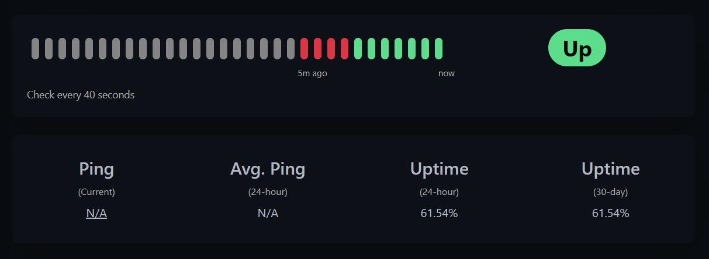

# Hypush

Hypush is a plugin for [Hytale](https://hytale.com/) servers. It allows you to monitor your Hytale server with tools
like [Uptime Kuma](https://uptimekuma.org/) or [Healthchecks](https://healthchecks.io/). Your server will periodically
perform requests against a configurable endpoint, usually provided by your health check tool. If there are no requests
made for some time, your health check tool knows that something is wrong.

## Setup

1. Copy the plugin into the `mods` directory of your server
2. Restart your server
3. A config file will be created
4. Edit the `config.json` and enter at least your health check URL
5. Restart your server once more

## Usage

### Configuration properties

| Property   | Description                                         |
|------------|-----------------------------------------------------|
| `Url`      | The URL of your health check endpoint               |
| `Interval` | The interval, in which requests should be performed |
